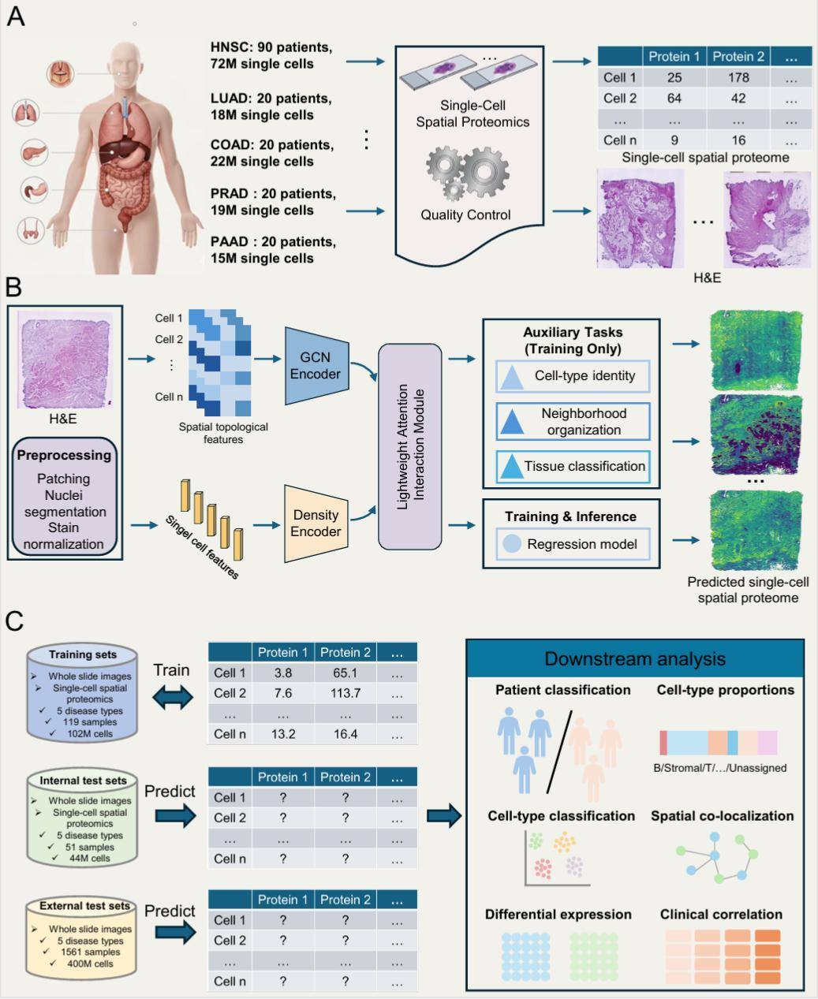

Histo2Prot: Single-Cell Spatial Profiling of the Tumor Microenvironment from Histology Using Deep Learning

Histo2Prot is a deep learning framework for inferring single-cell–resolved spatial proteomic profiles from routine whole-slide histopathology (H&E) images.
The method integrates cell-level morphology, cell–cell spatial topology, and multi-task learning to reconstruct protein expression landscapes across the tumor microenvironment (TME).

Framework Overview

Repository Structure

Histo2Prot  
├── DataProcess.py       
├── model.py             
├── train.py    
├── inference.py    
├── requirements.txt   
└── README.md

Data Preparation

Input Data

Histo2Prot assumes the following inputs:

Whole-slide H&E images

Precomputed cell/nuclei segmentation results

Stored as .npy files

Each file contains instance-level cell masks

Single-cell protein expression matrix

Used as regression targets during training

Note
Cell segmentation is performed externally (e.g., HoVerNet).
Histo2Prot does not include segmentation inference, and directly reads segmentation results.

Quality Control (QC)  

The preprocessing pipeline follows these steps:

H&E staining performed on the same tissue section as molecular profiling

Color normalization to reduce batch/staining variability

Automatic tissue detection on whole-slide images

Tiling into non-overlapping 20× patches

Exclusion of:

Background-dominated tiles

Low-information regions

The resulting paired H&E patches + single-cell protein profiles form the final dataset.

Training  
Step 1: Install Dependencies
pip install -r requirements.txt

Step 2: Run Training  
python train.py

The training script includes:  

Multi-task loss optimization

Early stopping

GPU acceleration (PyTorch Lightning)

Automatic saving of:

Model weights

Training loss curves

Hyperparameter configuration (YAML)

Inference  

After training, you can predict spatial proteomics on new H&E slides:

python inference.py

The inference pipeline:

Loads trained Histo2Prot model

Reads H&E patches + segmentation masks

Outputs:

Cell-level protein expression predictions

Requirements  

Key dependencies include:

PyTorch 2.0

TorchVision

Scanpy / Squidpy

Scikit-learn

NumPy / Pandas / SciPy

See requirements.txt for the full list.

Applications

Spatial proteomics reconstruction

Tumor microenvironment (TME) profiling

Digital pathology–omics integration

Biomarker discovery

Retrospective cohort analysis from archived H&E slides
